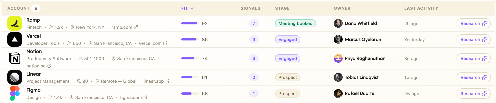
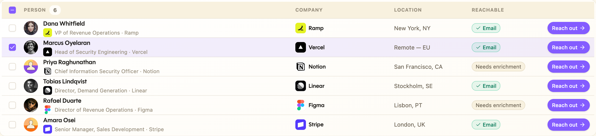
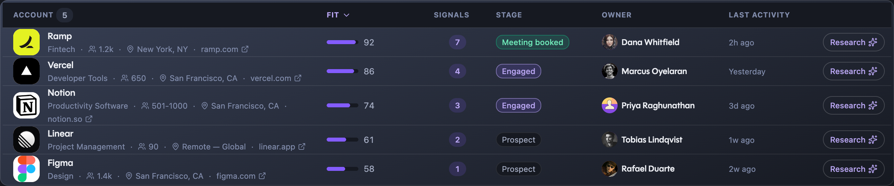
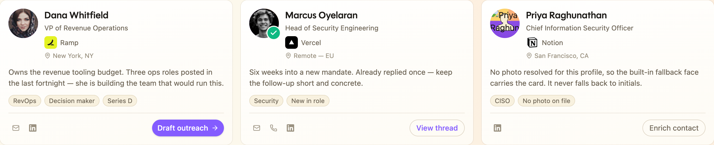
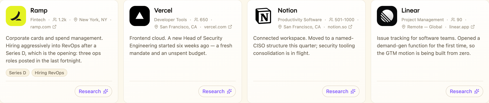
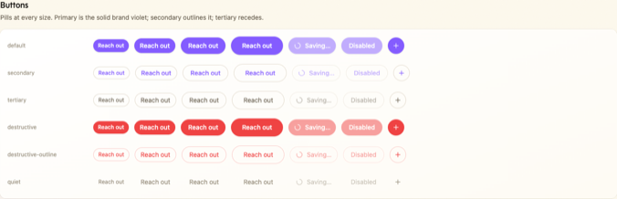

# Trayo GTM UI

**GTM apps worth showing the team.**

This is the design system the Trayo product is built from, packaged for the
tools you build on top of the [Trayo API](https://api.trayo.ai). Use it and what
you ship reads as part of that product rather than as something assembled beside
it — and it looks finished in the screenshot someone pastes into a thread, which
is where most internal tools are actually judged.

It also comes with the fiddly parts already right: **people** with real faces and
a fallback that still looks designed, **companies** with their actual logos, and
tables that stay legible at high row counts. Those are what a GTM screen is full
of, and they are where hand-built UI usually gives itself away.

There is no server-side logic here. These are presentational components. They do
not fetch, authenticate, or know anything about your data layer.

**v0.1** — the surface is stable enough to build on; expect additions.

**[See every component rendered, live →](https://ui.trayo.ai/demo)** · [ui.trayo.ai](https://ui.trayo.ai) · [llms.txt for coding agents](https://ui.trayo.ai/llms.txt)

---

## What it looks like

Most GTM screens are a table, so that is where the library does the most work.
`DataTable` composes `<Company>` and `<Person>` in its cells, which is what makes
a dense screen still read as Trayo.



Row selection, contact status and per-row actions:



Sorting, paging and selection are yours to own — the table renders and reflects
them, and ships loading and empty states so a list never flashes a false
"nothing found".



Add `class="dark"` to `<html>` and the whole palette flips. One token set, no
component changes.

### Entity cards





### Buttons



---

## Copy these files into your project

This library is **vendored, not installed.** You copy the source into your
application and it becomes yours — yours to read, yours to edit, and with no
dependency on wherever you got it from.

If you were handed a temporary URL to fetch it from, that URL is a delivery
mechanism and nothing more. **Never `npm install` from it**: that writes a
disappearing host into your `package.json` as a dependency spec, and every
future install, CI run and fresh clone breaks the day it goes away.

### 1. Drop in the source

From your project root:

```bash
npx degit trayoai/ui/src src/trayo-ui
```

No `npx`? `mkdir -p src/trayo-ui && curl -L https://ui.trayo.ai/trayo-ui.tar.gz | tar xz -C src`

You get `src/trayo-ui/` holding `index.ts`, `components/`, `lib/` and `styles/`
(the Figtree heading font included), plus a copy of this README and AGENTS.md.

`src/trayo-ui/` is the location assumed throughout; put it anywhere your project
keeps source and adjust the import paths to match.

### 2. Install the real dependencies

Ordinary public npm packages — these are permanent:

```bash
npm install react@^19 react-dom@^19 clsx tailwind-merge lucide-react \
  class-variance-authority tailwindcss @tailwindcss/vite \
  @radix-ui/react-avatar @radix-ui/react-checkbox @radix-ui/react-dialog \
  @radix-ui/react-dropdown-menu @radix-ui/react-label @radix-ui/react-popover \
  @radix-ui/react-scroll-area @radix-ui/react-select \
  @radix-ui/react-separator @radix-ui/react-slot @radix-ui/react-switch \
  @radix-ui/react-tabs @radix-ui/react-tooltip
```

Requires **Tailwind CSS v4** and **React 19**. React 18 is not supported: the
components take `ref` as an ordinary prop (a React 19 feature), so on React 18
refs are silently dropped and Radix `asChild` triggers — `<TooltipTrigger
asChild><Button/>`, popovers, dropdown menus — lose their anchor. If your app is
on React 18, upgrade it before adding the kit.

### 3. Wire up the CSS

In your CSS entry, in this order:

```css
@import 'tailwindcss';
@import './trayo-ui/styles/trayo-ui.css';
```

That single stylesheet brings the design tokens, the type roles, the Figtree
heading font and the animations. Tailwind must come first — the stylesheet
extends its theme.

No `@source` directive is needed: the components sit inside your own source
tree, which Tailwind v4 already scans.

Light is the default. Add `class="dark"` to `<html>` for the dark palette — the
whole token set flips; no component needs changing.

---

## The 30-second version

```tsx
import { AppShell, PageContainer, PageHeader, Person, CompanyCard, Button } from './trayo-ui'

export default function App() {
  return (
    <AppShell>
      <PageContainer>
        <PageHeader title="Target accounts" actions={<Button>Import</Button>} />
        <CompanyCard company={{ name: 'Ramp', domain: 'ramp.com', industry: 'Fintech' }} />
        <Person person={{ id: 'p-1', name: 'Dana Whitfield', title: 'VP RevOps', company: 'Ramp', companyDomain: 'ramp.com' }} />
      </PageContainer>
    </AppShell>
  )
}
```

`AppShell` is what makes a page look like Trayo rather than a default Tailwind
page — it paints the warm shell gradient, the fractal grain and the corner
glows. Wrap your app in it once.

---

## Tables

Most GTM screens are a table, and `DataTable` is the component you will reach for
most. It is **presentational**: you own sorting, paging and selection state, and
it renders and reflects them. Put a `<Company>` or `<Person>` in the identity
column and a dense screen still reads as Trayo.

```tsx
type AccountRow = { id: string; company: CompanyLike; owner: PersonLike; score: number; stage: string }

const columns: Column<AccountRow>[] = [
  {
    id: 'account',
    header: 'Account',
    accessor: (r) => <Company company={r.company} showWebsite />,
    className: 'min-w-[260px]',
    sortable: true,
  },
  { id: 'score', header: 'Fit',    accessor: (r) => <ScoreBar value={r.score} />, className: 'w-40', sortable: true },
  { id: 'stage', header: 'Stage',  accessor: (r) => <Badge variant="accent">{r.stage}</Badge>, className: 'w-40' },
  { id: 'owner', header: 'Owner',  accessor: (r) => <Person person={r.owner} variant="inline" />, className: 'w-48 hidden lg:table-cell' },
  { id: 'act',   header: '',       accessor: () => <Button size="xs" variant="secondary">Research</Button>, align: 'right', className: 'w-32' },
]

<DataTable
  columns={columns}
  rows={rows}
  getRowKey={(r) => r.id}
  count={rows.length}
  sort={sort}
  onSortChange={setSort}
  onRowClick={(r) => navigate(`/accounts/${r.id}`)}
  loading={isLoading}
  empty={<EmptyState title="No accounts match" />}
  selection={{ selectedKeys, onToggleRow, onToggleAllPage }}
  layout="fixed"
  tableClassName="min-w-[1040px]"
/>
```

### Column options

| Field | What it does |
|---|---|
| `id` | Stable key, and the sort key when `sortable` is set |
| `header` | Any node — a string, or a label with an icon |
| `accessor(row)` | Returns the cell. This is where `<Person>` / `<Company>` go |
| `align` | `left` (default), `center`, `right` |
| `width` / `className` | Sizing and responsive hiding, e.g. `w-40`, `hidden lg:table-cell`. Applied to the header **and** every body cell so they can't drift |
| `sortable` | Turns the header into a sort toggle keyed on `id` |

### Behaviour worth knowing

- **`loading`** renders skeleton rows instead of `rows`, so a list never flashes
  a false "nothing found" while a query is in flight. The `empty` fallback only
  shows when `!loading && rows.length === 0`.
- **`selection`** is fully controlled — you hold the selected-key set, so it can
  span pages. Omit it entirely and no checkbox column renders.
- **`layout="fixed"`** makes the per-column `width`/`className` hints
  authoritative. Pin the columns that matter and leave exactly one column
  width-less: it absorbs surplus space and is the first to shrink. Pair it with
  a `min-w-*` in `tableClassName` so the flexible column can't collapse to zero
  before horizontal scrolling kicks in.
- **`onRowClick`** makes the whole row navigate; interactive cells inside it
  still receive their own clicks.
- **`renderSubRow`** adds a full-width detail row beneath any row.

The raw `Table` / `TableHeader` / `TableRow` / `TableCell` primitives are
exported too, for tables that don't fit the `DataTable` shape.

---

## People and companies

These two are the reason this library exists. **Whenever you render a person or
a company, use them** instead of assembling an avatar and a name by hand.

### `<Person>` / `<PersonCard>`

A person always gets a **face**: their photo when it is available, otherwise one
of 50 illustrated fallbacks chosen stably from the person's id — the same person
gets the same face everywhere, forever. It never degrades to initials.

```tsx
<Person person={apiPerson} />                        // row — lists and tables
<Person person={apiPerson} variant="inline" />        // avatar + name, in a sentence
<Person person={apiPerson} variant="stacked" />       // centred, for a tile
<Person person={apiPerson} showContact contacted />   // email/phone/profile glyphs + a "we reached out" check
<PersonCard person={apiPerson} summary="…" tags={['CISO']} footer={<Button size="sm">Reach out</Button>} />
```

`PersonLike` is a loose superset of a `GET /v1/people` row, so an API response
passes straight through. Everything but `name` is optional.

> **The photo field has two names.** The Trayo API returns `profileImageUrl`
> from `GET /v1/people`, but a `POST /v1/find` contacts result carries
> `photoUrl` — and `photoUrl` is also what you send when creating a person.
> `<Person>` reads both (plus `imageUrl` / `avatarUrl`), so either shape works;
> `personPhotoUrl(person)` is exported if you need the resolved URL yourself.
> Reading only one spelling is the usual reason every avatar falls back to the
> placeholder face.

### `<Company>` / `<CompanyCard>`

Pass a **domain** and nothing else — the logo resolves itself, landing on a warm
initials tile for companies with no mark.

```tsx
<Company company={{ name: 'Ramp', domain: 'ramp.com' }} />
<Company company={apiAccount} variant="inline" />     // logo + name, for a table cell
<Company company={apiAccount} showWebsite />          // + industry · headcount · location · site
<CompanyCard company={apiAccount} summary="…" tags={['Series D']} footer={<Button size="sm">Research</Button>} />
```

`CompanyLike` is a loose superset of a `/v1` account. A published `logoUrl`
works too, but `domain` alone is the common and better case.

### The avatars on their own

```tsx
<PersonAvatar name="Dana Whitfield" personId="p-1" src={photo} size="lg" contacted />
<CompanyLogo name="Ramp" domain="ramp.com" size="md" />
<ToneAvatar name="Ada Lovelace" tone="violet" />   // non-person identities: teams, workspaces, bots
```

Sizes: `xs sm md lg xl 2xl`.

## Everything else

| What | Components |
|---|---|
| Page scaffolding | `AppShell` `PageContainer` `PageHeader` `Surface` `Well` |
| Decorative | `BrandMesh` (drifting brand gradient) `GradientText` |
| States | `EmptyState` `StatTile` `Skeleton` `Progress` |
| Type | `PageTitle` `SectionTitle` `CardTitle` `EntityName` `Body` `Meta` `Eyebrow` `SectionLabel` `Code` |
| Controls | `Button` `Input` `Textarea` `Select` `Checkbox` `Switch` `Label` `Tabs` |
| Display | `Badge` `TagChip` `Card` `Separator` `Tooltip` `ScrollArea` |
| Overlays | `Dialog` `Popover` `DropdownMenu` |

### Buttons

Pills at every size. `default` is the solid brand violet (one per screen area);
`secondary` outlines it; `tertiary` recedes; `quiet` is bare until hovered.
Sizes `xs sm default lg icon icon-sm`.

```tsx
<Button loading>Saving…</Button>              {/* the primitive owns the spinner */}
<Button variant="secondary">Research <Sparkles /></Button>
```

Never hand-roll a spinner swap inside a `<Button>` — pass `loading`.
Action glyphs (`Plus`, `Check`) lead; directional ones (`ArrowRight`,
`ExternalLink`) trail. Icons scale with the button size automatically — don't
size them per instance.

---

## House rules

Follow these and the result stays on-brand. Break them and it drifts.

1. **No raw colours.** No `#hex`, no `rgb()`, no Tailwind ramp classes
   (`text-blue-400`, `bg-slate-800`). Use the semantic classes:
   - surfaces — `bg-surface-shell` `bg-surface-card` `bg-surface-well` `bg-surface-row`
   - text — `text-text-primary` `text-text-secondary` `text-text-muted`
   - borders — `border-border-subtle` `border-border-strong`
   - brand — `bg-accent-brand` (fill) `text-accent-text` (readable) `bg-accent-soft` `border-accent-line`
   - status — `text-success-text` `bg-warning-soft` `border-*-line`

   These flip between light and dark on their own. A hand-written `dark:`
   override to patch a colour is the tell that you should have used a token.

2. **Two type vocabularies, never mixed.** *Content* (titles, names, body, meta,
   labels) uses a **role class**: `text-page-title` `text-section`
   `text-card-title` `text-name` `text-body` `text-meta` `text-label`
   `text-eyebrow` `text-code`. Roles carry the heading font —
   `text-[16px] font-semibold` silently drops it. *Controls* (buttons, inputs,
   badges, tabs) use the plain Tailwind scale (`text-sm font-medium`).

3. **Never arbitrary type.** No `text-[13px]`, `tracking-[0.07em]`,
   `leading-[1.55]`. The ramp is 11/12/13/14/16/18/24/40/56 and it is enough.

4. **Compose, don't fork.** Build from these components. If you find yourself
   writing a second bespoke `<button className="rounded-full …">` or a second
   hand-rolled `<table>`, that is the moment to use the primitive instead.

5. **Use `cn()`** (exported) to merge classes — it knows about the role classes,
   which plain `clsx` does not.

You own these files now, so editing them is fair game. Prefer extending a
variant over forking a component, and keep the token vocabulary intact — that
is what holds the aesthetic together.

---

## Configuration

Everything works with no provider. Wrap only to override:

```tsx
<TrayoUIProvider
  personImageProxy={(url) => `/api/img?u=${url}`}  // route person photos through your own proxy
  placeholderFaceBase="/images/placeholder"        // serve the fallback faces yourself
>
```

---

## Fonts and licenses

Headings are set in [Figtree](https://github.com/erikdkennedy/figtree), which is
licensed under the SIL Open Font License 1.1. Its woff2 files ship in
`styles/fonts/` together with `OFL.txt`, and that license file has to stay with
them wherever you copy them.

The Trayo app itself uses a commercially licensed heading face, which this
repository does not and cannot redistribute. Figtree was chosen to stand in for
it: same x-height, same letter shapes where it counts, and `size-adjust` in
`fonts.css` keeps table widths the same. If your team holds a license for a
different face, redefine `--font-heading` after importing `trayo-ui.css`.

## Developing the library itself

(Only relevant in the library's own repository, not in a consuming app.)

```bash
pnpm install
pnpm demo        # showcase at http://127.0.0.1:5177
pnpm demo:build  # static showcase in demo/dist
pnpm typecheck
./publish.sh     # build + publish the public kit, stamping the live base URL
```

`demo/src/Showcase.tsx` renders every component in both themes and is the
fastest usage reference.
