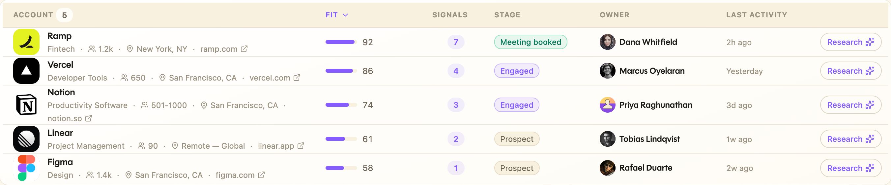
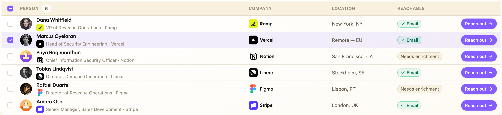
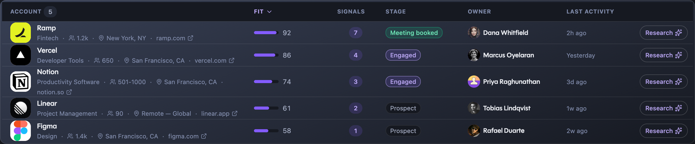
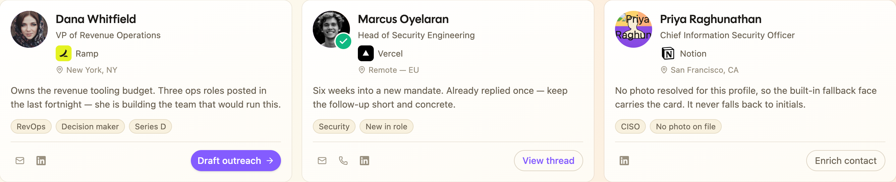
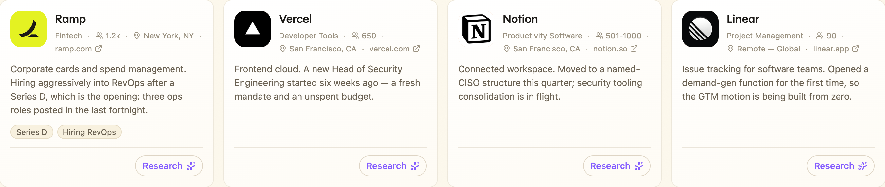
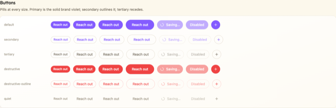

# Trayo GTM UI

**GTM apps worth showing the team.**

This is the design system the Trayo product is built from, packaged for the
tools you build on top of the [Trayo API](https://api.trayo.ai). Use it and what
you ship reads as part of that product rather than as something assembled beside
it — and it looks finished in the screenshot someone pastes into a thread, which
is where most internal tools are actually judged.

It also comes with the fiddly parts already right: **people** with real faces and
a fallback that still looks designed, **companies** with their actual logos, and
tables that stay legible at high row counts. Those are what a GTM screen is full
of, and they are where hand-built UI usually gives itself away.

There is no server-side logic here. These are presentational components. They do
not fetch, authenticate, or know anything about your data layer.

**v0.1** — the surface is stable enough to build on; expect additions.

**[See every component rendered, live →](https://ui.trayo.ai/demo)** · [ui.trayo.ai](https://ui.trayo.ai) · [llms.txt for coding agents](https://ui.trayo.ai/llms.txt)

---

## What it looks like

Most GTM screens are a table, so that is where the library does the most work.
`DataTable` composes `<Company>` and `<Person>` in its cells, which is what makes
a dense screen still read as Trayo.



Row selection, contact status and per-row actions:



Sorting and selection are yours to own — the table renders and reflects them.
Paging is built in but controlled: pass a `pagination` prop and the table
slices the rows and renders the control, so a 500-row list is never a 500-row
page. Loading and empty states ship too, so a list never flashes a false
"nothing found".



Add `class="dark"` to `<html>` and the whole palette flips. One token set, no
component changes.

### Entity cards





### Buttons



---

## Copy these files into your project

This library is **vendored, not installed.** You copy the source into your
application and it becomes yours — yours to read, yours to edit, and with no
dependency on wherever you got it from.

If you were handed a temporary URL to fetch it from, that URL is a delivery
mechanism and nothing more. **Never `npm install` from it**: that writes a
disappearing host into your `package.json` as a dependency spec, and every
future install, CI run and fresh clone breaks the day it goes away.

### 1. Drop in the source

From your project root:

```bash
npx degit trayoai/ui/src src/trayo-ui
```

No `npx`? `mkdir -p src/trayo-ui && curl -L https://ui.trayo.ai/trayo-ui.tar.gz | tar xz -C src`

You get `src/trayo-ui/` holding `index.ts`, `components/`, `lib/` and `styles/`
(the Figtree heading font included), plus a copy of this README and AGENTS.md.

`src/trayo-ui/` is the location assumed throughout; put it anywhere your project
keeps source and adjust the import paths to match.

### 2. Install the real dependencies

Ordinary public npm packages — these are permanent:

```bash
npm install react@^19 react-dom@^19 clsx tailwind-merge lucide-react \
  class-variance-authority tailwindcss @tailwindcss/vite \
  @radix-ui/react-avatar @radix-ui/react-checkbox @radix-ui/react-dialog \
  @radix-ui/react-dropdown-menu @radix-ui/react-label @radix-ui/react-popover \
  @radix-ui/react-scroll-area @radix-ui/react-select \
  @radix-ui/react-separator @radix-ui/react-slot @radix-ui/react-switch \
  @radix-ui/react-tabs @radix-ui/react-tooltip
```

Requires **Tailwind CSS v4** and **React 19**. The bundler must define
`process.env.NODE_ENV` (Vite, Astro, webpack, esbuild, Next and Bun all do);
`Button` reads it to warn about alias variant names in development. React 18 is not supported: the
components take `ref` as an ordinary prop (a React 19 feature), so on React 18
refs are silently dropped and Radix `asChild` triggers — `<TooltipTrigger
asChild><Button/>`, popovers, dropdown menus — lose their anchor. If your app is
on React 18, upgrade it before adding the kit.

### 3. Wire up the CSS

In your CSS entry, in this order:

```css
@import 'tailwindcss';
@import './trayo-ui/styles/trayo-ui.css';
```

That single stylesheet brings the design tokens, the type roles, the Figtree
heading font and the animations. Tailwind must come first — the stylesheet
extends its theme.

No `@source` directive is needed: the components sit inside your own source
tree, which Tailwind v4 already scans.

Light is the default. Add `class="dark"` to `<html>` for the dark palette — the
whole token set flips; no component needs changing.

---

## The 30-second version

```tsx
import { AppShell, PageContainer, PageHeader, Person, CompanyCard, Button } from './trayo-ui'

export default function App() {
  return (
    <AppShell>
      <PageContainer>
        <PageHeader title="Target accounts" actions={<Button>Import</Button>} />
        <CompanyCard company={{ name: 'Ramp', domain: 'ramp.com', industry: 'Fintech' }} />
        <Person person={{ id: 'p-1', name: 'Dana Whitfield', title: 'VP RevOps', company: 'Ramp', companyDomain: 'ramp.com' }} />
      </PageContainer>
    </AppShell>
  )
}
```

`AppShell` is what makes a page look like Trayo rather than a default Tailwind
page — it paints the warm shell gradient, the fractal grain and the corner
glows. Wrap your app in it once.

---

## Tables

Most GTM screens are a table, and `DataTable` is the component you will reach for
most. It is **presentational**: you own sorting, paging and selection state, and
it renders and reflects them — paging included, via the `pagination` prop below.
Put a `<Company>` or `<Person>` in the identity column and a dense screen still
reads as Trayo.

```tsx
type AccountRow = { id: string; company: CompanyLike; owner: PersonLike; score: number; stage: string }

const columns: Column<AccountRow>[] = [
  {
    id: 'account',
    header: 'Account',
    // size="md" (36px) in a table: the default 48px logo tile reads as a solid strip.
    accessor: (r) => <Company company={r.company} size="md" showWebsite />,
    className: 'min-w-[260px]',
    sortable: true,
  },
  { id: 'score', header: 'Fit',    accessor: (r) => <ScoreBar value={r.score} />, className: 'w-40', sortable: true },
  { id: 'stage', header: 'Stage',  accessor: (r) => <Badge variant="accent">{r.stage}</Badge>, className: 'w-40' },
  { id: 'owner', header: 'Owner',  accessor: (r) => <Person person={r.owner} variant="inline" />, className: 'w-48 hidden lg:table-cell' },
  { id: 'act',   header: '',       accessor: () => <Button size="xs" variant="secondary">Research</Button>, align: 'right', className: 'w-32' },
]

<DataTable
  columns={columns}
  rows={rows}
  getRowKey={(r) => r.id}
  count={rows.length}
  sort={sort}
  onSortChange={setSort}
  onRowClick={(r) => navigate(`/accounts/${r.id}`)}
  loading={isLoading}
  empty={<EmptyState title="No accounts match" />}
  selection={{ selectedKeys, onToggleRow, onToggleAllPage }}
  layout="fixed"
  tableClassName="min-w-[1040px]"
/>
```

### Paging

**Any list that can exceed ~50 rows is paged.** Never render it in full: a
500-row table is dozens of screens tall, and nobody scrolls it. `DataTable`
takes a controlled `pagination` prop — you hold the page, it renders the
`<Pagination>` footer ("1–25 of 382", prev/next, a compact page list) and,
when you have all the rows, does the slicing for you. `usePagination` holds
the state; it clamps the page when the list shrinks and resets to page 1 when
the page size changes.

```tsx
// Client-side: you have every row. Omit `total` and the table slices `rows`.
const paging = usePagination(rows.length, { pageSize: 25 })

<DataTable
  columns={columns}
  rows={rows}
  getRowKey={(r) => r.id}
  pagination={{
    page: paging.page,
    pageSize: paging.pageSize,
    onPageChange: paging.setPage,
    pageSizeOptions: [25, 50, 100],      // optional "Rows per page" Select
    onPageSizeChange: paging.setPageSize,
  }}
/>

// Server-side: hold the page yourself, fetch that page, and give the table
// the response's `total`. (`usePagination` needs the total up front, so it is
// the wrong tool here — the total arrives with the page.)
const pageSize = 25
const [page, setPage] = useState(1)
const { data, isLoading } = useQuery(['people', page], () =>
  fetch(`/v1/people?limit=${pageSize}&offset=${(page - 1) * pageSize}`).then((r) => r.json()),
)

<DataTable
  columns={columns}
  rows={data?.items ?? []}
  getRowKey={(r) => r.id}
  loading={isLoading}
  pagination={{ page, pageSize, total: data?.total, onPageChange: setPage }}
/>
```

Sort before you page (sort the full list, then hand it to the table). The
footer stays out of the way when there is a single page and no page-size
Select, so small lists can pass `pagination` unconditionally. For lists that
are not tables — a card grid, a feed — render `<Pagination>` yourself with the
same props.

### A short list in a card

With nothing to sort, select or page, the full table is more than a short list
needs. `variant="simple"`
sets the first and last cells flush with the card's own padding, drops the rule
under the last row, and shows the hover band only when the table has an
`onRowClick`. Put it in a padded `Surface`, not `padded={false}`, and let the
row be the click target in place of a button on every row. `hideHeader` drops
the column header row for a list whose columns explain themselves; the headers
are still read to screen readers.

```tsx
<Surface title="Who to call" description="6 stakeholders, ranked">
  <DataTable
    variant="simple"
    columns={columns}
    rows={stakeholders}
    getRowKey={(p) => p.id}
    onRowClick={open}
  />
</Surface>
```

Every table sizes its rows to the list. With six rows or fewer in total, the
rows are 88px and each `<Person>` or `<Company>` in a cell draws a 64px face or
logo with its name at card-title size (18px); with more, the rows are the
standard size with 48px faces. While `loading`, `skeletonRows` stands in for
the count, so set it to the number of rows you expect and the placeholders
come up at the size the rows will be. A `<Person>` or `<Company>` that is given its
own `size` keeps it, name included. The count is across every page, so the last
page of a long list does not change size. Pin it with `scale="default"` or
`scale="large"` when a filter can take the list across six rows and the size
should not change with it.

`variant="large"` pins the large size and the flush layout together, for a
list where the people or companies are the point
of the screen: 88px rows, and every `<Person>` or `<Company>` row in a cell
draws a 64px face or logo with its name at card-title size (18px). The table
sets the size, so the cells are written as for any other table: leave `size`
off.

```tsx
<DataTable variant="large" columns={columns} rows={stakeholders}
           getRowKey={(p) => p.id} onRowClick={open} />
```

The table passes the size down through `EntityScaleContext`, which is
exported: wrap a hand-built list in `<EntityScaleContext.Provider
value="large">` and the `<Person>` and `<Company>` rows inside draw large the
same way.

A list with no columns to align is an `EntityList`, not a table.

### Column options

| Field | What it does |
|---|---|
| `id` | Stable key, and the sort key when `sortable` is set |
| `header` | Any node — a string, or a label with an icon |
| `accessor(row)` | Returns the cell. This is where `<Person>` / `<Company>` go |
| `align` | `left` (default), `center`, `right` |
| `width` / `className` | Sizing and responsive hiding, e.g. `w-40`, `hidden lg:table-cell`. Applied to the header **and** every body cell so they can't drift |
| `sortable` | Turns the header into a sort toggle keyed on `id` |
| `skeleton` | Placeholder shape while `loading`: `person`, `company`, `badge`, or the default text bar |

### Behaviour worth knowing

- **`loading`** renders skeleton rows instead of `rows`, so a list never flashes
  a false "nothing found" while a query is in flight. The `empty` fallback only
  shows when `!loading && rows.length === 0`. Set a column's `skeleton` so the
  placeholder matches its cell (`person` for a `<Person>` column, and so on).
- **`selection`** is fully controlled — you hold the selected-key set, so it can
  span pages. Omit it entirely and no checkbox column renders.
- **`onToggleAllPage(selected, pageKeys)`** selects the *current page*, not the
  whole list. With client-side paging the table knows which rows are on the
  page and you don't, so add or remove the `pageKeys` it hands you rather than
  every key in `rows`. Rows `isRowSelectable` rejects are not in `pageKeys`.
- **`pagination`** never slices when `total` is given — the rows you pass are
  the page. Without `total`, it slices and reports `rows.length` as the total.
  The header `count` badge is independent; with paging the footer already says
  "of 382", so most tables drop `count`.
- **Rows are 60px tall**, enough for a `<Person>` cell's two lines. The header
  is a sentence-case label on the rows' own surface, set apart by a hairline.
  For a tighter table use the `dense` table dialect (see
  [Customer brand](#customer-brand)) rather than overriding cell heights.
- **`layout="fixed"`** makes the per-column `width`/`className` hints
  authoritative. Pin the columns that matter and leave exactly one column
  width-less: it absorbs surplus space and is the first to shrink. Pair it with
  a `min-w-*` in `tableClassName` so the flexible column can't collapse to zero
  before horizontal scrolling kicks in.
- **`onRowClick`** makes the whole row navigate; interactive cells inside it
  still receive their own clicks.
- **`renderSubRow`** adds a full-width detail row beneath any row.

The raw `Table` / `TableHeader` / `TableRow` / `TableCell` primitives are
exported too, for tables that don't fit the `DataTable` shape.

---

## People and companies

These two are the reason this library exists. **Whenever you render a person or
a company, use them** instead of assembling an avatar and a name by hand.

### `<Person>` / `<PersonCard>`

A person always gets a **face**: their photo when it is available, otherwise one
of 50 illustrated fallbacks chosen stably from the person's id — the same person
gets the same face everywhere, forever. It never degrades to initials.

```tsx
<Person person={apiPerson} />                        // row — lists and tables
<Person person={apiPerson} variant="inline" />        // avatar + name, in a sentence
<Person person={apiPerson} variant="stacked" />       // centred, for a tile
<Person person={apiPerson} showContact contacted />   // email/phone/profile glyphs + a "we reached out" check
<PersonCard person={apiPerson} summary="…" tags={['CISO']} footer={<Button>Reach out</Button>} />
<PersonBanner person={apiPerson} actions={<Button><Mail /> Contact details</Button>} />  // brand-coloured header band, one per screen
```

`PersonLike` is a loose superset of a `GET /v1/people` row, so an API response
passes straight through. Everything but `name` is optional.

A list of people (or companies) goes in `<EntityList>`, which owns the spacing:
12px above and below each row and a hairline between them (`divided={false}`
drops the hairline). The rows have no vertical padding of their own, so a
hand-spaced stack lets the avatars touch.

```tsx
<EntityList>
  {people.map((p) => <Person key={p.id} person={p} showContact />)}
</EntityList>
```

A list of labelled points — the reasons or signals behind a person or a company —
goes in `<FactList>`. Each label is set in the primary ink at name weight and
sits close to its own sentence, with more room between facts than inside one:

```tsx
<Well>
  <FactList title="Why now">
    <Fact label="FDA approval">Approved the 2026-2027 formulas.</Fact>
    <Fact label="Trial results">Positive Phase 3 results with Merck.</Fact>
  </FactList>
</Well>
```

Do not build this from a `<Meta>` label over a `<Body>` paragraph: the label
ends up lighter than the text it heads and the facts run together.

Contact links (`<PersonContactLinks>`, or `showContact` on a person) are plain
glyphs that take a circle on hover, so a row of them stays quiet in a table or
a list. On a `PersonCard` footer they are `outlined`, a hairline circle at
rest, so they read as controls beside the card's button; pass `outlined`
yourself to get that anywhere else.

A card is a glance, so it keeps its text short: `summary` clamps at three lines
with a "More" button that opens it in place, and `tags` shows three, then a
`+N` button that shows the rest. Both work from the keyboard and on touch. Pass one or two sentences and one-to-three-word tags.

The `footer` slot takes a bare `<Button>`. The card renders it compact and
secondary (`size="sm"`, `variant="secondary"`) unless you name another, keeps
it at the right at the width of its label, and drops a label too long for the
space beside the contact links onto its own line. It does not stretch:
`className="w-full"` has no effect there. A card repeats down a grid, so a
full-width primary on each one outweighs the people it sits under. The
defaults reach a `<Button>` written anywhere in the footer, including inside a
tooltip or menu trigger. A button that only exists inside your own component
(`footer={<MyButton />}`) is out of reach: give it `size="sm"
variant="secondary"` there.

The one person a panel is about (the author of a post, the owner of an account)
is `<Person variant="lead">`: a 96px face with the ring, the name at page-title
size, the title and the company each on a line. A list row stays the default.

A post with its author is `<PostCard>`. It draws the author in the lead layout,
keeps the text's line breaks and clamps it to four lines behind a "Show more"
switch, and puts the link out in the header.

```tsx
<PostCard
  author={apiPerson}
  text={post.text}
  published="Published 21 September 2026"
  href={post.url}
  linkLabel="Open on LinkedIn"
  note="Comments last loaded on 23 September 2026"
/>
```

`PersonBanner` is the header of a page or drawer about one person: a
full-width band in the brand colour with the face, name, title, company and one
action. The title and the company each get their own line, so a long title
never cuts the company off, and on a narrow band the action moves under the text.
Use it once per screen, at the top; a person in a list or grid is a `<Person>`
or `<PersonCard>`. Put a default (primary) `<Button>` in `actions` — the band
inverts it, filled with the band's foreground and labelled in the brand
colour, so it reads on any brand. A `tertiary` or `quiet` Button also works
when the action should recede.

`tone` sets the band: `solid` (default, the brand fill), `soft` (the brand
container, the same band in the pale tint) or `plain` (an ordinary card with no
fill or texture, for a page that already has a brand block). `size="compact"`
is for a drawer or a side panel: a 48px face, tighter padding, and the company
and title on one line where they fit. On the soft and plain tones a default
`<Button>` stays the brand's own solid.

In a dialog, use `<PersonDialog>`: it places the banner, keeps the close button
clear of it, scrolls the body and wraps the footer actions. It is 672px wide by
default (`size="2xl"`), so a title and company fit beside the action. `tone`
sets the banner's tone (`solid`, `soft` or `plain`).

```tsx
<PersonDialog
  person={apiPerson}
  open={open}
  onOpenChange={setOpen}
  actions={<Button>Add to sequence</Button>}
  footer={<Button size="sm" variant="secondary">Draft intro email</Button>}
>
  …the body…
</PersonDialog>
```

A `<PersonBanner>` placed in a `<DialogContent>` by hand also gets the room it
needs for the close button, but `<PersonDialog>` is the supported shape.

A dialog with no `size` is 576px wide (`xl`). Size any dialog with `size` (`small` | `medium` | `large`, or `sm` … `6xl`), not
a `max-w-*` class: the width is set per breakpoint, and a bare `max-w-2xl`
only replaces the phone value.

> **The photo field has two names.** The Trayo API returns `profileImageUrl`
> from `GET /v1/people`, but a `POST /v1/find` contacts result carries
> `photoUrl` — and `photoUrl` is also what you send when creating a person.
> `<Person>` reads both (plus `imageUrl` / `avatarUrl`), so either shape works;
> `personPhotoUrl(person)` is exported if you need the resolved URL yourself.
> Reading only one spelling is the usual reason every avatar falls back to the
> placeholder face.

### `<Company>` / `<CompanyCard>`

Pass a **domain** and nothing else — the logo resolves itself, landing on a warm
initials tile for companies with no mark.

```tsx
<Company company={{ name: 'Ramp', domain: 'ramp.com' }} />
<Company company={apiAccount} variant="inline" />     // logo + name, for a table cell
<Company company={apiAccount} showWebsite />          // + industry · headcount · location · site
<CompanyCard company={apiAccount} summary="…" tags={['Series D']} footer={<Button>Research</Button>} />
```

`CompanyLike` is a loose superset of a `/v1` account. A published `logoUrl`
works too, but `domain` alone is the common and better case.

### `<JobMove>`

A job change: where someone left and where they landed.

```tsx
<JobMove
  from={{ company: { name: 'Stripe', domain: 'stripe.com' }, title: 'Director, RevOps' }}
  to={{ company: { name: 'Ramp', domain: 'ramp.com' }, title: 'VP RevOps' }}
/>
```

With 512px or more to itself it is two equal tiles with an arrow between them;
in a narrower column (a phone-sized dialog, a side panel) it is two slim rows.
It follows its own width, not the viewport. `fromLabel` / `toLabel` rename the
two sides (defaults `Left` / `Joined`).

### The avatars on their own

```tsx
<PersonAvatar name="Dana Whitfield" personId="p-1" src={photo} size="lg" contacted />
<CompanyLogo name="Ramp" domain="ramp.com" size="md" />
<ToneAvatar name="Ada Lovelace" tone="violet" size="md" />   // non-person identities: teams, workspaces, bots
```

Sizes: `xs sm md lg xl 2xl`. `CompanyLogo` also takes `2xs` (16px), for a mark
inside a line of meta text.

`ToneAvatar` tones are `neutral` (the default, a grey), `violet`, `blue`,
`amber`, `rose` — a pale tint of the tone with darker initials — and `brand`,
the one solid mark. There is no green tone, because green on an avatar reads as
status; `teal` is still accepted and renders as `blue`. Without `size` it is
28px.

## Everything else

| What | Components |
|---|---|
| Page scaffolding | `AppShell` `AppShellNavLink` `PageContainer` `PageHeader` `Split` `Surface` `IconTile` `Well` `StatGrid` |
| Summaries | `HeroStat` `StatBand` `EntityStack` `Funnel` `SplitBar` `Meter` `MethodNote` (see [Summaries and breakdowns](#summaries-and-breakdowns)) |
| Breakdowns and small charts | `BreakdownTiles` `DistributionList` `ShareTicks` `ShareRing` `DivergingColumns` `ColumnChart` `Sparkline` `Ring` |
| Decorative | `BrandMesh` (drifting brand gradient) `GradientText` |
| States | `EmptyState` `StatTile` `Callout` `Skeleton` `Progress` |
| Type | `PageTitle` `SectionTitle` `CardTitle` `EntityName` `Body` `Meta` `Eyebrow` `SectionLabel` `Code` `DataLabel` |
| Controls | `Button` `Input` `Textarea` `Select` `Checkbox` `Switch` `Label` `Tabs` `SegmentedControl` `Pagination` (+ `usePagination`) |
| Display | `Badge` `TagChip` `Card` `EntityList` `FactList` `PostCard` `Separator` `Tooltip` `ScrollArea` |
| Overlays | `Dialog` `PersonDialog` `Popover` `DropdownMenu` |
| Feedback | `Toaster` `toast()` `useToast()` |
| Charts | `ChartLegend` `DataLabel` `CHART_COLORS` `CHART_SEQUENTIAL` `CHART_MUTED` `chartColor` `chartSequential` |
| Customer brand | `resolveBrandPalette` `checkBrandPalette` `fromBrandThemeContract` `brandSlotsAgentGuide` `brandPaletteCss` `brandAttributes` `BRAND_SLOTS` (see [Customer brand](#customer-brand)) |

### Page scaffolding

Give `AppShell` a `brand`, `nav` or `actions` and it renders the app's top bar:
sticky, blurred, on a hairline, its inner width aligned with `PageContainer`
(pass the same `width`). View links are `AppShellNavLink`s — quiet pills that
take the soft accent when `active`; use `asChild` to wrap your router's link.
A filter group is a `SegmentedControl`; a row of `StatTile`s goes in a
`StatGrid`, which is two columns on a phone and lets an odd last tile span both
so nothing dangles. A row of tiles is one way to summarise a page, not the
only one: see [Summaries and breakdowns](#summaries-and-breakdowns).

`PageContainer` spaces its sections. Put the `PageHeader`, `StatGrid`,
`Surface`s and `Callout`s directly inside it, with no wrapper `<div>` and no
margins between them: only direct children get the gap.

`PageHeader` names the page. Three sizes: the default 24px title with the
subtitle beside it, for inner views; `size="large"` (32px) for a header on a
card; `size="lead"` (40px, with a 16px subtitle stacked under it) for a tool's
main screen, where the title should still read in a thumbnail. An `eyebrow`
sits above the title, an `icon` on a tile before it, and `stats` puts up to
four bare figures on the right. `variant` sets what the header stands on:
`plain` (the page), `card` (a sheet of its own) or `band` (the brand
container). Pick one treatment for the whole app.

```tsx
<PageHeader
  size="lead"
  eyebrow="Mid-market FinServ · Q4"
  title="Target accounts"
  subtitle="15 companies this workspace did not already hold."
  stats={[{ label: 'Accounts', value: 15 }, { label: 'Contacts', value: 19 }]}
  actions={<Button>Push list</Button>}
/>
```

A panel with a name is a `Surface` with a `title`: the header strip (title,
optional `description`, `icon` and right-aligned `actions`) sits on the well
and the content on its own sheet below. Use it for a table, a chart or a list;
pass `padded={false}` when the content brings its own edges, as a `DataTable`
does. `framed={false}` keeps the header inside the one sheet.

```tsx
<Surface title="Accounts" description="62 accounts" padded={false}
         actions={<Button variant="secondary" size="sm">Export</Button>}>
  <DataTable … />
</Surface>
```

`Progress` with a `target` is plan against actual: a hatched bar for the plan
over a solid bar for `value`, with anything past the plan hatched in the danger
colour. Give a group of them the same `max` so their lengths compare.

```tsx
<Progress aria-label="Outreach" value={72} target={60} max={100} />
```

The textures the components use are plain classes, for the rare case you need
one yourself. Each goes on an absolutely positioned, `aria-hidden` layer inside
an `isolate` parent, behind the content:

| Class | Use |
|---|---|
| `bg-dot-grid` | The empty part of a screen — an empty state, an idle panel. Never behind a table or body text. `dot-grid-right` pins it to the right edge |
| `noise-grain` | Grain over a gradient strip or a solid fill |
| `diagonal-fade` | Fine diagonal lines fading in toward the bottom-right, in the element's text colour |
| `bg-hatch` (+ `hatch-soft`) | A hatched fill in the element's text colour: "not the settled number" |
| `animate-bar-grow` | A chart bar growing from its baseline; stagger with `animation-delay` |

```tsx
<AppShell
  brand="Churn radar"
  nav={
    <>
      <AppShellNavLink active>Board</AppShellNavLink>
      <AppShellNavLink onClick={() => go('/runs')}>What ran</AppShellNavLink>
    </>
  }
  actions={<Button size="sm">Run now</Button>}
>
  <PageContainer>
    <StatGrid>
      <StatTile label="Accounts" value="317" hint="283 with events" />
      <StatTile label="At risk" value="3" hint="$2.6M ARR" delta="+1" />
      <StatTile label="Signals this week" value="47" delta="-4%" />
      <StatTile label="Meetings booked" value="12" />
      <StatTile label="Reply rate" value="18%" delta="+2.1%" />
    </StatGrid>

    <SegmentedControl
      aria-label="Risk band"
      value={band}
      onValueChange={setBand}
      options={[
        { value: 'all', label: 'All', count: 59 },
        { value: 'red', label: 'Red', count: 3 },
        { value: 'amber', label: 'Amber', count: 7 },
        { value: 'green', label: 'Green', count: 49 },
      ]}
    />
  </PageContainer>
</AppShell>
```

Bare `<AppShell>` still renders no bar. `SegmentedControl` is a radio group —
arrow keys move the selection — for filtering what is on screen; view switching
belongs in the top bar, and content panels belong to `Tabs`.

### Summaries and breakdowns

A strip of equal `StatTile`s is one shape among several, and using it on every
screen is what makes two tools look like the same tool. Pick by what the
numbers are:

| The numbers are… | Use |
|---|---|
| One figure that matters, with context | `HeroStat` (with a `ColumnChart` in `media`) |
| Stages of one pipeline | `Funnel` |
| A few plain counts, none of them the headline | `StatBand` |
| Figures that each carry a change or a trend | `StatBand headed` with a `Sparkline` or `Ring` in `media` |
| A count per company, which the user can pick | `BreakdownTiles` |
| Parts of one whole, with a row each | `DistributionList` |
| Parts of one whole, in a line or around a total | `ShareTicks` / `ShareRing` |
| Two parts of one whole | `SplitBar` |
| Two opposed counts per period (joined, left) | `DivergingColumns` |
| A score on a row, against a pass mark | `Meter` |
| How the data was made (searches, steps, sources) | `MethodNote`, or `stats` on the `PageHeader` |
| Independent KPIs with a change | `StatGrid` of `StatTile`s |

One summary pattern per page, and none at all when the table already shows the
count. A figure with no sentence to go with it belongs in the `PageHeader`
`stats` or a `MethodNote`, not on a card of its own.

`Split` sets a main column beside a second one from `lg` (stacked below), so a
page is not one full-width stack. `ratio` is `2:1` (default), `3:1` for a table
and a thin rail, `3:2` when the aside holds a chart, `1:1` for two equals;
`side="start"` moves the aside to the left, and `stretch={false}` leaves each
column at its own height.

```tsx
<Split
  aside={
    <Surface title="Where the gripes land" description="Pick one to filter">
      <BreakdownTiles items={vendors} value={vendor} onValueChange={setVendor} />
    </Surface>
  }
>
  <HeroStat
    title="Gripes kept"
    description="From 264 posts read"
    value={20}
    chip={<Badge variant="warning">10 hot</Badge>}
    reading="Firebase and MongoDB Atlas draw 14 of the 20."
    media={<ColumnChart items={weeks} label="Gripes kept per week" />}
    figures={[
      { label: 'Posts read', value: 264, hint: '6 searches' },
      { label: 'Hot', value: 10, share: 0.5 },
    ]}
  />
</Split>
```

`StatBand` is a few figures on one sheet, split by hairlines. Each item takes a
`label`, a `value`, an optional `hint` and `delta`, and either an `icon` or a
`media` node at the right. `EntityStack` is the media for a count of people or
companies: an overlapping pile of `<PersonAvatar size="sm">`s or
`<CompanyLogo size="xs">`s, with the rest collapsed into a `+N` disc.

```tsx
<StatBand
  items={[
    {
      label: 'Accounts imported',
      value: 15,
      media: (
        <EntityStack max={3}>
          {accounts.map((a) => <CompanyLogo key={a.id} name={a.name} domain={a.domain} size="xs" />)}
        </EntityStack>
      ),
    },
    { label: 'On the list', value: 34, icon: <ListChecks /> },
  ]}
/>

<StatBand
  headed
  items={[
    { icon: <Radar />, label: 'Signals this month', value: 47, delta: '+12%', hint: 'vs last month',
      media: <Sparkline area values={perWeek} /> },
    { icon: <Building2 />, label: 'Account coverage', value: '53%', media: <Ring value={8 / 15} /> },
  ]}
/>
```

`Funnel` takes `stages` in order, widest first, and says what share of the
step before came through; `orientation="horizontal"` sets them in a row.
`Meter` is a score in a table cell or list row, with the pass mark ticked on
its bar (`mark`).

```tsx
<Funnel
  stages={[
    { label: 'Commenters', value: 10, hint: 'author excluded' },
    { label: 'Passed the ICP', value: 5, hint: 'pass mark 55' },
    { label: 'Verified work email', value: 4 },
  ]}
/>
<Meter value={82} mark={55} label="Strong" />
```

The share components (`ShareTicks`, `ShareRing`, `DistributionList`) take the
same segments: `{ label, value, display?, hint?, muted? }`. Colour marks the
segment, in the chart palette's order; `muted` draws the remainder in the one
neutral fill. `DistributionList` rows also take a `company` (for its logo) or
an `icon`, and a `detail` line.

```tsx
<DistributionList
  items={[
    { label: 'Firebase', value: 7, detail: 'mostly cost', company: { name: 'Firebase', domain: 'firebase.com' } },
    { label: 'Others', value: 2, muted: true },
  ]}
/>
<DivergingColumns upLabel="Joined" downLabel="Left" items={[{ label: 'May', up: 12, down: 5 }]} />
```

`DivergingColumns` is one measure in two directions, so it is one colour:
solid above the line and outlined below. The two sides are told apart by
shape, under any brand palette.

`MethodNote` says where a screen's data came from as figures, with the prose
closed behind a switch. With `flow` the `points` are a sequence with an arrow
between them (rows returned, then distinct, then kept); without it they are
parallel sources side by side, each with a `detail` sentence. A caveat or a
warning is still a `Callout`.

```tsx
<MethodNote
  icon={<ListFilter />}
  title="How this list was built"
  summary="6 LinkedIn topic searches, narrowed to buyers complaining."
  flow
  points={[
    { value: 300, label: 'rows returned' },
    { value: 264, label: 'distinct posts' },
    { value: 20, label: 'kept after reading' },
  ]}
>
  Posts written by people who work at those vendors were dropped.
</MethodNote>
```

These are drawn with plain elements and SVG, in the chart tokens, with no
chart dependency. They show shape and proportion; none has an axis or hover
values. `Sparkline` shows direction only. Their bars follow `Progress`: a thin
solid bar for the settled number, hatching for the part that is not (the
remainder, the dropped, a score under its pass mark). `bar="solid"` on
`Funnel`, `SplitBar`, `Meter`, `HeroStat` or `DistributionList` draws that
part as a flat neutral track instead; use one style across an app.

### Buttons

Variants: `default | secondary | tertiary | quiet | destructive | destructive-outline | destructive-quiet`.
Sizes: `xs | sm | default | lg | icon | icon-sm`.

Pills at every size. `default` is the solid brand violet (one per screen area);
`secondary` outlines it; `tertiary` recedes; `quiet` is bare until hovered.
There is no `ghost`, `outline`, `link` or `primary`. Those shadcn names are
accepted so a build does not fail on them — `ghost` → `tertiary`, `outline` →
`secondary`, `link` → `quiet`, `primary` → `default` — but each one logs a
console warning in development. Write the canonical name.

```tsx
<Button loading>Saving…</Button>              {/* the primitive owns the spinner */}
<Button variant="secondary">Research <Sparkles /></Button>
```

Never hand-roll a spinner swap inside a `<Button>` — pass `loading`.
Action glyphs (`Plus`, `Check`) lead; directional ones (`ArrowRight`,
`ExternalLink`) trail. Icons scale with the button size automatically — don't
size them per instance.

### Callouts

The note box: "how this was built", a coverage caveat, a data limit, a result
that cleared the bar. A short `title` as the eyebrow, one to three lines of
body, at most one `action`. Tones `note` (default) `info` `success` `warning`
`destructive`; `compact` puts title and body on one line. `texture` sets what
is drawn behind the copy, in the tone's colour: `diagonal` (default), `dots`,
`wash` (the tone deepening toward the right, no pattern) or `none`. Pick one
for the whole app.

```tsx
<Callout title="How this was built" action={<a href="/method">Full method</a>}>
  Every row came back from the Trayo API; nothing here is hand-typed.
</Callout>
<Callout tone="warning" icon={<AlertTriangle />} title="Post coverage is incomplete">
  Only public posts from the last 30 days were read.
</Callout>
```

Do not build this from `Surface` + `SectionLabel` + `Body` — that is the drift
this component exists to stop.

### Toasts

Mount `<Toaster />` once, inside `<AppShell>`, then call `toast()` from
anywhere — no provider, no context. The stack sits bottom-right on desktop and
spans the bottom on a phone; it is a polite live region, and hovering it pauses
auto-dismiss.

```tsx
<AppShell>
  <Toaster />
  …
</AppShell>

toast({ title: 'List saved', description: '12 accounts added to Q3 targets.' })
toast({ variant: 'success', title: 'Email found', duration: 3000 })
toast({ variant: 'destructive', title: 'Export failed', action: { label: 'Retry', onClick: retry } })
```

Variants: `default` `success` `warning` `destructive` `preview`. Options:
`title`, `description`, `duration` (ms, default 5000, `Infinity` to keep),
`action` (one button), `id` (a repeat call with the same id updates that toast
in place instead of stacking), `eyebrow`, `icon`. `useToast()` returns
`{ toast, dismiss }` for people who prefer a hook.

**Stubbed actions use the `preview` variant.** A demo that has no Salesforce,
mail or Slack connection still has "Push", "Send" and "Post" buttons. When one
is clicked, say what *would* have happened and that nothing left the browser —
never a silent success, never a hand-rolled banner:

```tsx
toast({
  variant: 'preview',
  title: 'Push to Salesforce',
  description: 'Would create 3 leads under the Ramp account.',
})
```

It renders the eyebrow "Preview - nothing was sent" above the title; pass
`eyebrow` to reword it.

### Charts

The common shapes are components already: columns, shares, funnels and
sparklines are in [Summaries and breakdowns](#summaries-and-breakdowns). Reach
for those first. Anything else (bubbles, treemaps, quadrants, a chart with an
axis) is built from the same tokens as everything else. Nothing in a chart is a hex colour or an arbitrary
font size.

- **Series colour** — the categorical palette `chart-1` … `chart-5` (brand
  violet, teal, amber, rose, blue), in that fixed order. Classes where you can
  (`bg-chart-1`, `fill-chart-2`, `stroke-chart-3`, `text-chart-4`);
  `CHART_COLORS[i]` / `chartColor(i)` for an inline SVG `fill` or `stroke`
  prop. Assign series in sequence and keep the assignment stable; a sixth
  series folds into "Other". In a bubble, scatter or treemap — where any two
  marks can touch — keep to the first three.
- **Intensity** (momentum, score, density) — the sequential ramp
  `chart-seq-1` … `chart-seq-5` / `CHART_SEQUENTIAL`, or `chartSequential(t)`
  for a `0..1` value. One hue, light to dark; never for identity.
- **Out of scope** (outside ICP, not tracked, other) — `bg-chart-muted` /
  `CHART_MUTED`. The one neutral fill.
- **Labels** — `<DataLabel>` (`text-data-label`, `--text-caption`): tabular, muted. It is
  the only sanctioned size below Meta and it is for axis ticks, mark labels
  and dense numeric annotations only — never prose. `as="text"` puts it on an
  SVG text node.
- **The key** — `<ChartLegend items={[{ label, color }]}>` whenever there are
  two or more series.

```tsx
import { ChartLegend, DataLabel, chartColor, CHART_MUTED } from './trayo-ui'

// width comes from a ResizeObserver on the container — see below
<svg width={width} height={120} viewBox={`0 0 ${width} 120`}>
  {series.map((s, i) => (
    <rect key={s.id} x={i * 40} y={120 - s.value} width={32} height={s.value}
          fill={s.inIcp ? chartColor(i) : CHART_MUTED} />
  ))}
  <DataLabel as="text" x={0} y={116} textAnchor="start">0</DataLabel>
</svg>
<ChartLegend items={series.map((s, i) => ({ label: s.name, color: chartColor(i) }))} />
```

Never `style={{ background: '#…' }}`, never `text-[10px]` / `text-[11px]`.
Text inside a chart wears text tokens, not the series colour — the swatch
carries identity, the label reads.

Size the SVG in pixels (measure the container with a `ResizeObserver` and
draw at that width) rather than stretching a fixed `viewBox` to `w-full`: a
scaled viewBox scales the text with it, and an 11px label drawn at 1.8× is
no longer 11px. That is what pushed earlier charts to `text-[9px]`.

---

## House rules

Follow these and the result stays on-brand. Break them and it drifts.

1. **No raw colours.** No `#hex`, no `rgb()`, no Tailwind ramp classes
   (`text-blue-400`, `bg-slate-800`). Use the semantic classes:
   - surfaces — `bg-surface-shell` `bg-surface-card` `bg-surface-well` `bg-surface-row`
   - text — `text-text-primary` `text-text-secondary` `text-text-muted`
   - borders — `border-border-subtle` `border-border-strong`
   - brand — `bg-accent-brand` (fill) `text-accent-text` (readable) `bg-accent-soft` `border-accent-line`
   - status — `text-success-text` `bg-warning-soft` `border-*-line`

   These flip between light and dark on their own. A hand-written `dark:`
   override to patch a colour is the tell that you should have used a token.

2. **Two type vocabularies, never mixed.** *Content* (titles, names, body, meta,
   labels) uses a **role class**: `text-page-title` `text-section`
   `text-card-title` `text-name` `text-body` `text-meta` `text-label`
   `text-eyebrow` `text-code`, plus `text-page-title-lg` and `text-lead` for a
   large or lead `PageHeader`. Roles carry the heading font —
   `text-[16px] font-semibold` silently drops it. *Controls* (buttons, inputs,
   badges, tabs) use the plain Tailwind scale (`text-sm font-medium`).

3. **Never arbitrary type.** No `text-[13px]`, `tracking-[0.07em]`,
   `leading-[1.55]`. The ramp is 11/12/13/14/16/18/24/32/40/56 and it is enough.
   Below `text-meta` there is exactly one role, `text-data-label`
   (`--text-caption`), and it is for chart and axis labels only —
   `text-[10px]` is never the answer.

4. **Compose, don't fork.** Build from these components. If you find yourself
   writing a second bespoke `<button className="rounded-full …">` or a second
   hand-rolled `<table>`, that is the moment to use the primitive instead.

5. **Use `cn()`** (exported) to merge classes — it knows about the role classes,
   which plain `clsx` does not.

6. **Body is the default; Meta is for the small print.** `<Body>`
   (`text-body`, `--text-sm`) for paragraphs, summaries and the main line of a
   card; `<Meta>` (`text-meta`, `--text-xs`, muted) only for timestamps, counts
   and secondary attributes. A screen set mostly in Meta reads as grey and
   unfinished. Name the role, never the pixel size.

7. **A tool is not a landing page.** `<GradientText>` is for one phrase in a
   hero and `<BrandMesh>` for one hero or empty state — not a page title, not
   the backdrop of a table or a stat strip. `<PageHeader>` with a plain title
   is the default; a tool's main screen takes `size="lead"`, still with a
   plain title.

You own these files now, so editing them is fair game. Prefer extending a
variant over forking a component, and keep the token vocabulary intact — that
is what holds the aesthetic together.

---

## Customer brand

Building an app for a specific company? Give it that company's styling and let
the kit supply the language. Two depths:

- **Brand** (default): the company's colours are the canvas — page, cards,
  text, buttons, links, focus rings, selection, the brand gradient, the charts
  and, when the brand has one, the top bar. Trayo contributes what makes it
  recognisably Trayo: the components, pill buttons, type roles, radius, grain,
  motion and status colours. Dark mode keeps the kit's dark ladder tinted with
  the brand's hue. The warm peach glow in the page's top-right corner is
  Trayo's own colour, so a branded page drops it; the cool glow takes the
  brand's primary.
- **Accent only** (`surfaces: 'trayo'`): the page, cards and text stay the
  kit's cream; only the accent, charts and chrome take the brand.

Two more things make one branded app look unlike the next at a glance, and are
on by default (`emphasis: 'bold'`): a brand whose contract has no coloured
`shell` gets a top bar in a deep step of its primary, and the mesh band takes
the brand's colours instead of Trayo's peach and cream. The resolved palette
also says which theme the brand reads best in — `palette.theme` is `'dark'`
for a dark primary on a dark bar — so set `class="dark"` on `<html>` when it
says so. `emphasis: 'quiet'` turns both off.

**One call does all of it.** `applyBrand(document, contract, { theme, dialect, canvas })` resolves the palette, writes the stylesheet, sets the attributes and the dark class, and applies the dialect — idempotent, and it throws on a bad contract rather than shipping half a brand:

```ts
import { applyBrand } from './trayo-ui'
const palette = applyBrand(document, contract, { theme: 'light', dialect: 'editorial' })
console.log(palette.theme, palette.adjustments)
```

**Canvas.** A page given as white or grey takes the brand's hue as a soft tint by default (an off-white page with near-white cards, so a cyan or blue brand does not turn the screen blue), and dark mode is built in that hue. Pass `canvas: 'vibrant'` for a visibly coloured page, or `canvas: 'neutral'` to keep the page and cards exactly as given and dark mode on the kit's own slate, so the brand colour shows only on controls and accents. A page that already has a colour is kept as given in every case.

**Container tone.** Every palette carries the brand's container (Material's `primaryContainer`: tone 90 with tone-10 text; 30/90 in dark) and a tertiary one, as `bg-container text-container-foreground` and `bg-container-tertiary …`. Use them where the brand should sit on a surface — a selected row, a stat strip, a side panel — with readable text guaranteed. `canvas: 'vibrant'` tints a neutral page harder than the default `'soft'`, still 7:1 for text.

**Dialects.** Component-level choices an app commits to once and the kit applies everywhere: `callout` (bar-left / bar-right / filled / outlined), `card` (flat / hairline / lifted / tinted), `table` (zebra / cards / dense / tinted-head), `button` (soft / outline), `tile` (tinted / big-number). Two apps in different dialects feel like different products at full size; one app never mixes them. Pass a preset (`plain`, `editorial`, `tinted`, `compact`) or an object to `applyBrand`, or set `dialectAttributes(dialect)` on `<html>` yourself. `dialectAgentGuide()` documents the axes for an agent. None of them touch the pill buttons, type roles, faces or grain.

You choose **what** the colours are; the kit works out **how** to use them.
Colour lists from logo APIs come by prominence, not role (PayPal's starts with
black), so pick deliberately. The slots are the fields of the **brand theme
contract**, the JSON a brand-research agent writes (`brandSlotsAgentGuide()` is
that prompt):

| Field | | Role |
|---|---|---|
| `primary` | required | The colour the company is known for. A black-and-white brand uses its black. Chart series 1. |
| `onPrimary` | optional | Text on primary, as the brand itself pairs them. Kept when it reads at 4.5:1; on a narrow miss (3:1 or better) primary takes a small lightness step until it does; further off, white or ink replaces it. |
| `backgroundDark` / `surfaceDark` | optional | The brand's own dark-mode page and cards, used as given (Vercel's black, Linear's near-black). Without them dark mode is derived from the brand's hue. They need `background`. |
| `shell` / `onShell` | optional | The brand's own product chrome (Slack's aubergine) — paints the `AppShell` top bar. Omit when that chrome is white. |
| `accents[]` | optional | Chart series 2–5, in order (missing ones filled from the kit's series, skipping hues already taken); the first is also the decorative secondary (gradient end, mesh). |
| `background` `surface` `text` `mutedText` | optional | Page, cards, main and supporting text. Left out with `surfaces: 'trayo'`. |
| `primaryDark` | optional | The dark-mode fill, for an official dark colour or a black-and-white brand. |

```tsx
import {
  brandAttributes, brandPaletteCss, checkBrandPalette, fromBrandThemeContract, resolveBrandPalette,
} from './trayo-ui'

// Either slots directly…
const input = { primary: '#611f69', shell: '#4a154b', accents: ['#36c5f0', '#2eb67d'] }
// …or the agent's brand theme contract. Default applies the company's page,
// cards and text too; `{ surfaces: 'trayo' }` keeps the kit's cream instead.
// const { input, notes } = fromBrandThemeContract(contract)

const problems = checkBrandPalette(input)   // [] — or messages to hand back to whoever picked
const palette = resolveBrandPalette(input)

// Once, at the app root:
document.head.insertAdjacentHTML('beforeend', `<style>${brandPaletteCss(palette, 'html')}</style>`)
for (const [k, v] of Object.entries(brandAttributes(palette))) document.documentElement.setAttribute(k, v)
```

What the resolver guarantees, so you never adjust a colour for contrast:

- text on a brand fill reads at 4.5:1, white or ink picked for you (a supplied
  `onPrimary`/`onShell` is kept only when it reads; an `onPrimary` that
  narrowly misses is kept and the fill takes a small step instead, so Vanta's
  white stays on its purple);
- accent text and links are a darker step of the brand where the brand itself
  is too light (yellow, sky blue) — the fill keeps the brand colour;
- dark mode lifts the fill until it stands out; a black-and-white brand fills
  with near-white;
- shell text, hover and selected rows read on the shell;
- accents become chart series that clear 3:1 on the card, light and dark, and
  that can be told from each other: a series too close to an earlier one in a
  theme (a navy primary and a sky accent, both lightened for a dark card)
  gives way there to the nearest kit colour that is clearly apart, and the
  swap is reported in `adjustments`;
- on the brand's surfaces, text clears 7:1 and supporting text 4.5:1 (a
  derived secondary tone clears 7:1, so it stays apart from meta text), borders
  and the hover row are derived, and every check above runs against those
  surfaces instead of the kit's;
- the level is the same for every brand: secondary text, meta text and accent
  text all clear 4.5:1 on the page, the well, the card and the brand
  container (`bg-container`), whether the brand colour is a navy or a pale
  cyan. Inside `bg-container` the secondary and meta tones switch to steps of
  the container's own foreground, so `<Body>` and `<Meta>` read there without
  extra classes. A derived ink is a near-neutral, so the greys and borders
  mixed from it do not turn into tones of the brand.

Without `data-brand` on `<html>` nothing changes. The live demo at
[ui.trayo.ai/demo](https://ui.trayo.ai/demo) has a brand switcher.

---

## Configuration

Everything works with no provider. Wrap only to override:

```tsx
<TrayoUIProvider
  personImageProxy={(url) => `/api/img?u=${url}`}  // route person photos through your own proxy
  placeholderFaceBase="/images/placeholder"        // serve the fallback faces yourself
>
```

---

## Fonts and licenses

Headings are set in [Figtree](https://github.com/erikdkennedy/figtree), which is
licensed under the SIL Open Font License 1.1. Its woff2 files ship in
`styles/fonts/` together with `OFL.txt`, and that license file has to stay with
them wherever you copy them.

The Trayo app itself uses a commercially licensed heading face, which this
repository does not and cannot redistribute. Figtree was chosen to stand in for
it: same x-height, same letter shapes where it counts, and `size-adjust` in
`fonts.css` keeps table widths the same. If your team holds a license for a
different face, redefine `--font-heading` after importing `trayo-ui.css`.

## Developing the library itself

(Only relevant in the library's own repository, not in a consuming app.)

```bash
pnpm install
pnpm demo        # showcase at http://127.0.0.1:5177
pnpm demo:build  # static showcase in demo/dist
pnpm typecheck
./publish.sh     # build + publish the public kit, stamping the live base URL
```

`demo/src/Showcase.tsx` renders every component in both themes and is the
fastest usage reference.
